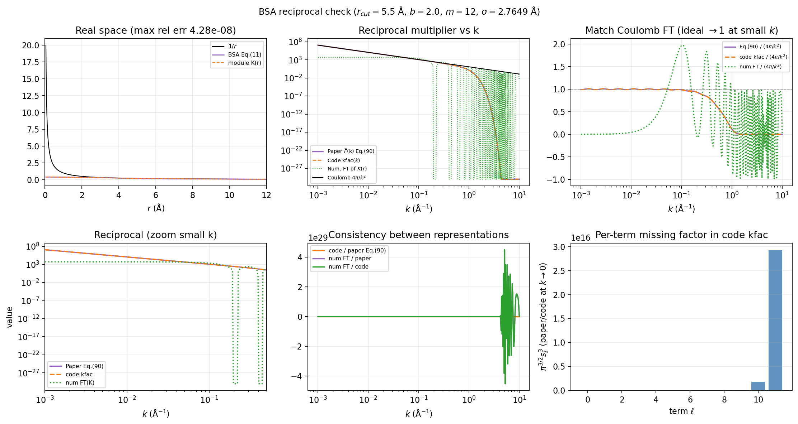

# BSA 初值设置与验证结果

本文说明 SOG 高斯核的 **BSA（bilateral series / u-series）初值**如何设置，以及实空间、倒空间与 Coulomb 极限的对照结果。本仓库**仅保留 BSA 初值**。

相关代码：`src/sog/module/gaussian.py`、`src/sog/sog.py`。

---

## 1. BSA 初值公式

当 `amp=None` 且未显式传入 `bandwidth` 时，`Gaussian` 按实空间 u-series 初始化（Kim 等 SOG 方法式 11）：

$$
\omega_\ell = \sqrt{\frac{2}{\pi}}\, \frac{\ln b}{\sigma}\, b^{-\ell}, \qquad
s_\ell = \sqrt{2}\, b^\ell \sigma, \qquad \ell = 0,\ldots,M-1.
$$

**约束：**

- $b > 1$（默认 $b = 2.0$）
- $M$ 为项数（默认 `m = 12`）
- $\sigma$ 可由截断半径得到：$\sigma = r_{\mathrm{cut}} / \texttt{RCUT\_TO\_SIGMA}$，其中 `RCUT_TO_SIGMA = 1.9892536839080267`（见 `sog.py`）

**与代码内部存储的对应关系：**

- `bandwidth`$_\ell$ $= s_\ell^2/2 = (\sigma b^\ell)^2$
- `amp`$_\ell$ $= \omega_\ell \cdot \texttt{bandwidth}_\ell$
- 有效实空间权重：$\omega_\ell = \texttt{amp}_\ell / \texttt{bandwidth}_\ell$

实空间核：

$$
K(r) = \sum_\ell \frac{\texttt{amp}_\ell}{\texttt{bandwidth}_\ell}
\exp\!\left(-\frac{r^2}{2\,\texttt{bandwidth}_\ell}\right).
$$

---

## 2. 如何配置

### 2.1 可配置的 BSA 初值参数

通过 `Sog({...})` 或 `les_arguments` 传入。下表为**影响 BSA 初值**的键（`sog.py` → `Gaussian`）：

| 参数 | 默认值 | 含义 |
|------|--------|------|
| `b` | `2.0` | BSA 几何比，需 **> 1**；控制 $s_\ell=\sqrt{2}\,b^\ell\sigma$ 与 $\omega_\ell\propto b^{-\ell}$ |
| `m` | `12` | SOG 项数 $M$（$\ell=0,\ldots,M-1$） |
| `r_cut` | 无（可选） | 实空间截断半径（Å）；若给定则 $\sigma=r_{\mathrm{cut}}/\texttt{RCUT\_TO\_SIGMA}$ |
| `sigma` | `2.180…` | 直接指定 $\sigma$（Å）；与 `r_cut` 二选一，**同时给时 `r_cut` 优先** |
| `amp` | `None` | 若显式传入则**跳过 BSA 公式**，按给定值初始化 `amp` |
| `bandwidth` | `None` | 若显式传入则**跳过** $\sigma,b,m$ 几何带宽；且 `amp=None` 时会报错 |
| `trainable_kernel` | `True` | `False` 时初值固定、训练不更新 `amp`/`bandwidth` |

**典型 BSA 初值路径：** `amp=None` 且 `bandwidth=None` → 由 `b`、`m` 与 `sigma`（或 `r_cut`）自动生成式 (11) 的 $\omega_\ell,s_\ell$。

#### `r_cut` 与体系 cutoff 的关系（重要）

- **`sog` 包不会**根据体系类型自动推断 `r_cut`；若不传 `r_cut`，则使用固定默认 $\sigma\approx 2.18\,\mathrm{\AA}$（与具体体系 cutoff **无关**）。
- **推荐做法：** 对每个体系，令 `r_cut` 等于该 MLIP **短程部分的 cutoff**（与 CACE `Cace(cutoff=...)`、数据集 `get_dataset_from_xyz(cutoff=...)` 同一数值），使 SOG 长程核的 BSA 尺度与短程势截断一致。
- 文档与验证图中的 **`5.5` 仅为 MAPbI$_3$ 示例**（`cutoff=5.5`），不是全局默认值；水体系常用 `4.5` Å 等，应随体系而变。
- **CACE-SOG 训练脚本**中通常把变量 `cutoff` 传入 `les_arguments["r_cut"]`，或通过环境变量覆盖，例如 MAPbI$_3$：
  `CACE_LES_MAPBI3_SOG_R_CUT` 默认取 `str(cutoff)`；水体系类似使用 `CACE_LES_WATER_SOG_R_CUT`。

```python
cutoff = 5.5  # 与 CACE 表示、数据集 cutoff 一致；换体系时改这里
model = Sog({"use_atomwise": False, "r_cut": cutoff, "b": 2.0, "m": 12})
```

也可在构造时直接传关键字：`Sog({...}, r_cut=cutoff)`（见 `test/test_r_cut_sigma.py`）。

倒空间 k 网格密度（不进入 BSA 公式，但影响周期能量）：

| 参数 | 默认值 | 含义 |
|------|--------|------|
| `n_dl` | `1.0` | 倒空间网格步长尺度（见 `Gaussian.n_dl`） |

### 2.2 直接使用 `Sog`

```python
from sog import Sog

cutoff = 5.5  # 示例：MAPbI3；应与该体系短程 cutoff 相同

model = Sog({
    "use_atomwise": False,
    "r_cut": cutoff,
    "b": 2.0,
    "m": 12,
})
```

等价地可显式设 `sigma` 而不传 `r_cut`（$\sigma = r_{\mathrm{cut}}/\texttt{RCUT\_TO\_SIGMA}$）：

```python
model = Sog({"use_atomwise": False, "sigma": cutoff / 1.9892536839080267, "b": 2.0, "m": 12})
```

### 2.3 CACE-LES / `LesWrapper`

```python
cutoff = 5.5  # 与 CACE cutoff 一致；不同体系改用对应 cutoff

les_e = LesWrapper(
    energy_key="ewald_potential",
    compute_bec=False,
    les_arguments={
        "r_cut": cutoff,
        "b": 2.0,
        "m": 12,
    },
)
```

训练脚本中常用环境变量（示例）：

- `CACE_LES_MAPBI3_SOG_R_CUT`（默认可等于脚本里的 `cutoff`）
- `CACE_LES_MAPBI3_SOG_B=2.0`
- `CACE_LES_MAPBI3_SOG_M=12`

（`init_mode` 配置项已移除；库内固定为 BSA。）

### 2.4 固定核（不训练）

```python
model = Sog({"trainable_kernel": False, "r_cut": cutoff, "b": 2.0, "m": 12})
```

（`cutoff` 含义同 §2.2。）

---

## 3. 倒空间乘子 `kfac`

周期体系使用倒空间结构因子路径。对单项 $\omega_\ell \exp(-r^2/s_\ell^2)$，3D 傅里叶变换为（式 90 单项）：

$$
\widetilde K_\ell(k) = \pi^{3/2}\, s_\ell^3\, \omega_\ell\,
\exp\!\left(-\frac{s_\ell^2 k^2}{4}\right)
= \pi^{3/2}\, (2\,\texttt{bandwidth}_\ell)^{3/2}\, \omega_\ell\,
\exp\!\left(-\frac{\texttt{bandwidth}_\ell\, k^2}{2}\right).
$$

总乘子：

$$
\texttt{kfac}(k) = \sum_\ell \widetilde K_\ell(k).
$$

周期长程能量（电荷，简化）：

$$
U_{\mathcal{F}} \propto \frac{1}{2V}\sum_{\mathbf{k}\neq 0} \texttt{kfac}(|\mathbf{k}|)\, |\rho(\mathbf{k})|^2.
$$

**要点：** 截断到有限 $M$ 项时，`kfac` 在中小 $k$ 可逼近 Coulomb 的 $4\pi/k^2$，但逐项一般不等于 $4\pi/k^2$；训练通过调整 `amp`/`bandwidth` 拟合目标势能面。

---

## 4. 验证结果

### 4.1 单元测试

| 测试文件 | 验证内容 |
|----------|----------|
| `test/test_gaussian_bsa_init.py` | `bandwidth`、`amp/bandwidth` 与 BSA 式 (11) 一致；`Sog` 默认 `b=2.0` |
| `test/test_gaussian_kfac_ft.py` | `kfac` 与式 (90) 及解析 3D FT 一致（相对误差 $< 10^{-5}$） |

运行（需 `qqz` 或已安装依赖的环境）：

```bash
source ~/miniconda3/etc/profile.d/conda.sh && conda activate qqz
cd /path/to/sog-github
PYTHONPATH=src python test/test_gaussian_bsa_init.py
PYTHONPATH=src python test/test_gaussian_kfac_ft.py
```

### 4.2 数值对照摘要

`plot_bsa_kspace_vs_coulomb_ft.py` 在默认参数 $r_{\mathrm{cut}}=5.5\,\mathrm{\AA}$、$b=2$、$M=12$（$\sigma=2.7649\,\mathrm{\AA}$）下生成 `bsa_kspace_vs_coulomb_ft.png` 与 `bsa_kspace_vs_coulomb_ft_summary.json`。

| 指标 | 结果 |
|------|------|
| 实空间 $K(r)$ vs 式 (11) u-series | 最大相对误差 $\sim 4.3\times 10^{-8}$ |
| 代码 `kfac` vs 式 (90) | 重合（见测试） |
| `kfac` / $(4\pi/k^2)$ 在 $k \in [0.001, 0.01, 0.1]\ \mathrm{\AA}^{-1}$ | 比值约 $0.986\text{–}1.004$（$\sim 1\%$ 量级） |

**对照图**（与上表同一组 BSA 初值）：



子图说明（$r_{\mathrm{cut}}=5.5\,\mathrm{\AA}$，$b=2.0$，$m=12$）：

| 位置 | 内容 |
|------|------|
| 左上 | 实空间：模块 $K(r)$（虚线）与式 (11) BSA u-series（实线）重合；远场逼近 $1/r$ |
| 中上 | 倒空间：代码 `kfac(k)` 与式 (90) 解析 FT 重合；小 $k$ 与 $4\pi/k^2$ 同量级 |
| 右上 | $\widetilde K/(4\pi/k^2)$：中小 $k$ 比值 $\approx 1$（$\sim 1\%$ 偏差） |
| 左下 | 小 $k$ 放大，确认长程 Coulomb 极限 |
| 中下 | 代码 / 式 (90) 比值 $\approx 1$（全 $k$ 一致） |
| 右下 | 逐项 $\ell=0$ 尺度诊断（高 $\ell$ 项在 $k\to0$ 快速衰减，属预期） |

`bsa_kspace_vs_coulomb_ft_summary.json` 摘录：

```json
{
  "r_cut_A": 5.5,
  "b": 2.0,
  "m": 12,
  "realspace_max_rel_err_vs_eq11": 4.28e-08,
  "paper_over_coulomb_at_k": {
    "k": [0.001, 0.00317, 0.01006, 0.1012],
    "ratio": [0.991, 1.004, 1.004, 0.986]
  },
  "conclusion": "Real-space BSA init matches Eq.(11). Code kfac matches Eq.(90). At moderate k, sum approximates 4*pi/k^2."
}
```

作图：

```bash
source ~/miniconda3/etc/profile.d/conda.sh && conda activate qqz
PYTHONPATH=src python plot_bsa_kspace_vs_coulomb_ft.py
```

---

## 5. 训练与复现建议

1. **周期体系**（如 MAPbI$_3$）：前向自动走倒空间；BSA 初值保证 $kfac$ 与实空间核自洽。
2. **可训练参数**：仍为 `gaussian.amp`、`gaussian.bandwidth`；初值只影响优化起点。
3. **旧模型**：若在「`kfac` 缺 3D FT 尺度」或「非 BSA 常数初值」版本上训练过的 checkpoint，长程标度可能不一致，建议用当前代码重训。

---

## 6. 相关文件

| 文件 | 说明 |
|------|------|
| `src/sog/module/gaussian.py` | BSA 初值、`_kspace_gaussian_ft_scale`、`kfac` |
| `src/sog/sog.py` | `RCUT_TO_SIGMA`、默认 `b=2.0` |
| `test/test_gaussian_bsa_init.py` | 初值回归 |
| `test/test_gaussian_kfac_ft.py` | 倒空间 FT 回归 |
| `plot_bsa_kspace_vs_coulomb_ft.py` | 实/倒/Coulomb 对比作图脚本 |
| `bsa_kspace_vs_coulomb_ft.png` | 上节对照图（$r_{\mathrm{cut}}=5.5$，$b=2$，$m=12$） |
| `bsa_kspace_vs_coulomb_ft_summary.json` | 数值摘要 |

---

*文档版本：2026-05，与仅 BSA 初值的 `sog-github` 发布版同步。*
