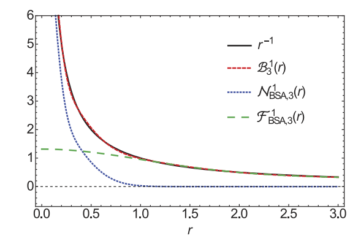

 
# SOG(sum-of-Guassian)方法

SOG是除了Ewald分裂之外，将1/r核分解为短程和长程部分的另一种分裂技术。

与Ewald分裂不同的是，SOG通过一系列高斯近似相互作用核，使得短程和长程分别与小带宽和大带宽分组。SOG分解对于计算长程相互作用特别有用，因为FFT将受益于允许分离变量的高斯函数。

### 双边级数近似（bilateral series approximation,BSA）
注意到我们有

$$\begin{aligned}\Gamma(\beta)&=\int_{0}^{\infty}e^{-a}\cdot a^{\beta-1}da\\&=r^{2\beta}\cdot \int_{0}^{\infty}e^{-br^2}\cdot b^{\beta-1}db\quad (a=br^2)\\&=r^{2\beta}\cdot \int_{-\infty}^{\infty}e^{-e^{t}r^{2}+\beta t}dt \quad (b=e^t)\end{aligned}$$

我们有以下积分恒等式

$$\frac{1}{r^{2\beta}}=\frac{1}{\Gamma(\beta)}\int_{-\infty}^{\infty}e^{-e^{t}r^{2}+\beta t}dt,$$

其中$\Gamma()$为Gamma函数，取$\beta=1/2$，采用变量替换$t=log(x^2/2\sigma^2)$。（$\Gamma(\frac{1}{2})=\sqrt{\pi}$）

$$\frac{1}{r}=\frac{2}{\sqrt{2\pi\sigma^2}}\int_{-\infty}^{\infty}exp\left[-\frac{1}{2}\left(\frac{rx}{\sigma}\right)^2\right]dx$$

接下来我们需要用到泊松求和公式

$$\sum_{n\in\mathbb{Z}}f(t+nT)=\sum_{k\in\mathbb{Z}}\frac1T\cdot\hat{f}\left(\frac kT\right)e^{2\pi i\frac kTt}$$

特殊值带入可得常见结论
$$\sum_{n\in\mathbb{Z}}f(n)=\sum_{n\in\mathbb{Z}}\hat{f}(n)$$

接下来取$f(x)=\frac{2\ln b}{\sqrt{2\pi\sigma^2}}\frac{1}{b^x}\exp\left[-\frac{1}{2}\left(\frac{r}{b^x\sigma}\right)^2\right]$ 我们可以得到双边级数近似:

<!-- $$\sum_{\ell\in\mathbb{Z}}f(\ell)=\sum_{n\in\mathbb{Z}}\int_{-\infty}^\infty f(x)e^{-i2\pi nx}dx$$

换元$u=b^{-x}r$可以得到
$$\sum_{\ell\in\mathbb{Z}}f(\ell)=\frac{1}{r}+\frac{1}{r}exp\left[-\frac{i2\pi nlnr}{lnb}\right]\sum_{n\neq 0,n\in\mathbb{Z}}\int_{0}^\infty \frac{2}{\sqrt{2\pi\sigma^2}}\exp\left[-\frac{1}{2}\left(\frac{u}{\sigma}\right)^2\right]u^{i2\pi n/\ln b}dx  $$ -->

<!-- 后面项当$\ln b \to 0$，即$b\to1$时会趋向于0，我们可以得到双边级数近似: -->

$$\begin{equation}
\frac{1}{r}\approx\frac{2\ln b}{\sqrt{2\pi\sigma^2}}\sum\limits_{\ell=-\infty}^{\infty}\frac{1}{b^\ell}\exp\left[-\frac{1}{2}\left(\frac{r}{b^\ell\sigma}\right)^2\right]\equiv B_b^\sigma(r)
\end{equation}$$

这里$b>1$是一个常数，注意到$G_\sigma(r)=e^{-r^2/2\sigma^2}/\sqrt{2\pi\sigma^2}$是宽度为$\sigma$的高斯函数。误差有一个渐近界：

$$\left|1-\frac{2r\ln b}{\sqrt{2\pi\sigma^2}}\sum\limits_{\ell=-\infty}^{\infty}\frac{1}{b^\ell}\exp\left[-\frac{1}{2}\left(\frac{r}{b^\ell\sigma}\right)^2\right]\right|\lesssim2\sqrt{2}\exp\left(-\frac{\pi^2}{2\ln(b)}\right)$$

### u-series方法

u-series方法将$1/r$分成一个短程项$\mathcal{N}_b^\sigma(r)$与一个长程项$\mathcal{F}_b^\sigma(r)$

$$
\mathcal{N}_b^\sigma(r) = \left\{ \begin{array}{ll}
1/r - \mathcal{F}_b^\sigma(r), & \text{if } r < r_c \\
0, & \text{if } r \geq r_c
\end{array} \right.$$

其中$\mathcal{F}_b^\sigma(r)$是SOG展开，取了双边级数近似的正部并且在$\ell=M$处截断
$$\mathcal{F}_b^\sigma(r)=\sum_{\ell=0}^M\omega_\ell e^{-r^2/s_\ell^2}$$

$$w_\ell=(\pi/2)^{-1/2}b^{-\ell}\sigma^{-1}\ln b \quad  \mathrm{and}\quad s_\ell=\sqrt{2}b^\ell\sigma.$$

截断半径$r_c$取的是$r\mathcal{F}_b^\sigma(r)-1$的最小根。这样的分解有一些好处：
- 电势在截止半径范围内是精确的，并且在截止点处是连续的
- 在$r_c$处的势也可以实现高阶连续性，即$C^1$条件将保证在该条件下的力的连续性。
$$\frac1{r_c^2}-\partial_r\mathcal{F}_b^\sigma(r_c)=0$$

- 对于固定的b和$\sigma$，这些连续条件可以通过调整最窄高斯函数的权值$\omega_0$来共同达到，然后解连续性方程来确定$r_c$。重新定义最窄高斯权值是必要的，以防止较大的误差
$$\omega_0=\frac{1}{e^{-r_c^2/s_0^2}}\left[\frac{1}{r_c}-\mathcal{F}_b^\sigma(r_c)\right]$$

由于这些良好的特性，用户可以通过减少计算工作量来生成Ewald分解的准确性。此外，如果使用FFT，高斯的可分性有利于节省一半的顺序通信轮数。

### 长程项的傅里叶展开

按照SOG分解势能可以被分解为短程项与长程项，$U=U_{\mathcal{N}}+U_{\mathcal{F}}$
$$U_{\mathcal{N}}=\frac{1}{2}\sum_{\boldsymbol{n}}'\sum_{i,j}q_iq_j\mathcal{N}_b^\sigma(|\boldsymbol{r}_{ij}+\boldsymbol{n}\circ\boldsymbol{L}|)$$

$$U_{\mathcal{F}}=\frac{1}{2}\sum_{\boldsymbol{n}}'\sum_{i i}q_{i}q_{j}\mathcal{F}_{b}^{\sigma}(|\boldsymbol{r}_{ij}+\boldsymbol{n}\circ\boldsymbol{L}|)$$

$U_{\mathcal{N}}$的和是绝对快速收敛的，可以在实空间的$r=r_c$处截断以简化计算。$U_{\mathcal{F}}$求和是条件收敛的，在傅里叶空间中处理。

三维空间中的傅里叶变换为
$$\widetilde{f}(\boldsymbol{k}):=\int_{\Omega}f(\boldsymbol{r})e^{-i\boldsymbol{k}\cdot\boldsymbol{r}}d\boldsymbol{r}\quad\mathrm{~and~}\quad f(\boldsymbol{r})=\frac{1}{V}\sum_{\boldsymbol{k}}\widetilde{f}(\boldsymbol{k})e^{i\boldsymbol{k}\cdot\boldsymbol{r}}$$

其中$\boldsymbol{k}=2\pi(m_x/L_x,m_y/L_y,m_z/L_z)$，$\boldsymbol{m}=(m_{x},m_{y},m_{z}) \in \mathbb{Z}^{3}$，$k=|\boldsymbol{k}|$

$\mathcal{F}_b^\sigma(r)$的傅里叶变换为
$$\widetilde{\mathcal{F}}_b^\sigma(\boldsymbol{k})=\pi^{3/2}\sum_{\ell=0}^M\omega_\ell s_\ell^3e^{-s_\ell^2k^2/4}$$

傅里叶空间中的长程项为
<!-- $$U_{\mathcal{F}}=U_{\mathcal{F}}^*+U_{\mathcal{F}}^0-U_{\mathcal{F}}^{self}$$ -->

$$U_{\mathcal{F}}=U_{\mathcal{F}}^*-U_{\mathcal{F}}^{self}$$

第一项是傅里叶变换+傅里叶反变换的结果（除去k=0 mode），第二项是k=0 mode的表达，这与不同的无穷远处边界有关，之后会进行考虑，第三项是自能项，排除利用结构因子计算使得粒子和自己的作用（事实上没这玩意）被计算的情况，方法同Eward方法中的长程项计算方式

$$U_\mathcal{F}^*=\sum_{|\boldsymbol{k}|\neq0}\widetilde{\mathcal{F}}_b^\sigma(\boldsymbol{k})\frac{|\rho(\boldsymbol{k})|^2}{2V}$$

$$U_{\mathcal{F}}^{self}=\frac{1}{2}\sum_{i=1}^Nq_i^2\cdot \mathcal{F}_b^\sigma( r=0 )=\frac{(b-b^{-M})\ln b}{\sqrt{2\pi\sigma^2}(b-1)}\sum_{i=1}^Nq_i^2.$$

通过对长程项能量的傅里叶展开，可以分别在实空间和傅里叶空间中处理$U_{\mathcal{N}}$和$U_{\mathcal{F}}$。设$r_c$为实空间的截断半径，$I(i)$为第$i$个粒子的邻接列表，即在截断半径内的粒子集合。作用在第$i$个粒子$F_i$上的力除去$F_i^0=-\nabla_{\mathbf{r}_i}U_{\mathcal{F}}^0$这一项后还有两项可以具体计算出来：

$$\boldsymbol{F}_{\mathcal{N},i}=\sum_{j\in\mathbb{I}(i)}q_{i}q_{j}\left(\frac{1}{2r_{ij}^{3}}-\sum_{\ell=0}^{M}\frac{\omega_{\ell}}{s_{\ell}^{2}}e^{-r_{ij}^{2}/s_{\ell}^{2}}\right)\boldsymbol{r}_{ij}\\\boldsymbol{F}_{\mathcal{F},i}=- \sum_{j\in\mathbb{I}(i)}\frac{q_{i}\boldsymbol{k}}{V}\cdot\widetilde{\mathcal{F}}_{b}^{\sigma}(\boldsymbol{k})\operatorname{Im}\left(e^{-i\boldsymbol{k}\cdot\boldsymbol{r}_{i}}\rho(\boldsymbol{k})\right)$$

在给定截止半径的情况下，计算短程项部分的成本与$N$和每个粒子在体积$4πr_c^3$内的平均邻居的乘积成正比。在u-series方法[43]中，傅里叶空间的截止$k_c$设为$O(1/s_0)$，与最窄高斯带宽成反比，并采用基于网格的FFT来加速计算。记$r_0 = r_c s_0/\sqrt{2}$是$r\mathcal{F}_b^1(r)-1$的最小根。由于截止频率内的傅里叶模式成比例$k_c^3 = O(1/s_0^3)$，因此总计算成本的最小化导致u-series方法的复杂度为$O(r^{3/2}_0)$。对于FFT，网格的网格间距也与$s_0$成正比，导致计算量至少与网格点数$O(1/s_0^3)$呈线性缩放[47,13]。在下文中，我们将在傅里叶空间中引入随机批处理策略，通过避免使用FFT来很好地处理这个问题。所得到的RBSOG具有线性0 (N)复杂度，计算成本与SOG的最小带宽$s_0$无关。

### k=0 mode $U_{\mathcal{F}}^0$项分析

$U_{\mathcal{F}}^0$是一个发散项，需要适当处理以满足系统的宏观特性。对于Ewald型方法，这一点已经进行了讨论[49,56,26,14]，但对于SOG型方法，这一点尚未得到探讨。

我们关于$\mathbf{k}$进行泰勒级数展开，取$\mathbf{k}\to 0$，然后得到

$$U_{\mathcal{F}}^{0}=\frac{\pi^{3/2}}{2V}\lim_{\boldsymbol{k}\to\boldsymbol{0}}\sum_{i,j}q_{i}q_{j}\sum_{\ell=0}^{M}w_{\ell}s_{\ell}^{3}\left[1-s_{\ell}^{2}|\boldsymbol{k}|^{2}/4+i\boldsymbol{k}\cdot\boldsymbol{r}_{ij}-\frac{1}{2}(\boldsymbol{k}\cdot\boldsymbol{r}_{i,j})^{2}+\mathcal{O}(|\boldsymbol{k}|^{3})\right]$$

在求和中，由于电荷中性，前两项消失了。值得注意的是，即使对于非中性系统(例如，表面电荷被隐式处理的准二维系统)，这些项也不依赖于$r$，因此可以被归一化，第三项也由于对称条件而消失$\boldsymbol{k}\cdot \boldsymbol{r}_{ij}=-\boldsymbol{k}\cdot \boldsymbol{r}_{ji}$。

$$U_{\mathcal{F}}^{0}=-\frac{1}{4V}\lim_{\boldsymbol{k}\to\mathbf{0}}\sum_{i,j}q_{i}q_{j}(\boldsymbol{k}\cdot\boldsymbol{r}_{ij})^{2}\widetilde{\mathcal{F}}_{b}^{\sigma}(0)$$

接下来计算$\widetilde{\mathcal{F}}_{b}^{\sigma}(0)$，注意到

$$\widetilde{\mathcal{F}}_b^\sigma(\boldsymbol{k})=\frac{4\pi}{k^2}-\int_{\Omega_{r_c}}\left[\frac{1}{|\boldsymbol{r}|}-\mathcal{F}_b^\sigma(|\boldsymbol{r}|)\right]e^{-i\boldsymbol{k}\cdot\boldsymbol{r}}d\boldsymbol{r},$$

其中$\Omega_{r_c}$是原点为中心$r_c$半径的球，库伦核$1/r$傅里叶变换之后是$4\pi/k^2$，证明见https://joyfulphysics.net/index.php/archives/154

 因此$\widetilde{\mathcal{F}}_b^\sigma(\boldsymbol{k})$在$\mathbf{k}\to 0$时为$4\pi/k^2$

$$U_{\mathcal{F}}^0=-\frac{\pi}{V}\sum_{i,j}q_iq_j\lim_{\boldsymbol{k}\to\boldsymbol{0}}\frac{(\boldsymbol{k}\cdot\boldsymbol{r}_{ij})^2}{k^2}.$$

上式与Ewald求和的结果一致[26,14]。这并不让人惊讶因为当$k\to 0$时这一项描述的是$r\to\infty$极限情况下长程的静电关联。因为SOG在$M \to\infty$对于远场极限是精确的，它自然地给出了Eward分解的一致性。

如果锡纸边界条件(tinfoil boundary conditions)对于$r\to\infty$，介质介电常数(在这设置为1)变为无穷大则$U_{\mathcal{F}}^0$消失。

### 参考

Liang, J., Xu, Z., & Zhou, Q. (2023). Random batch sum-of-Gaussians method for molecular dynamics simulations of particle systems. SIAM Journal on Scientific Computing, 45(5), B591-B617.

Predescu, C., Lerer, A. K., Lippert, R. A., Towles, B., Grossman, J. P., Dirks, R. M., & Shaw, D. E. (2020). The u-series: A separable decomposition for electrostatics computation with improved accuracy. The Journal of Chemical Physics, 152(8).